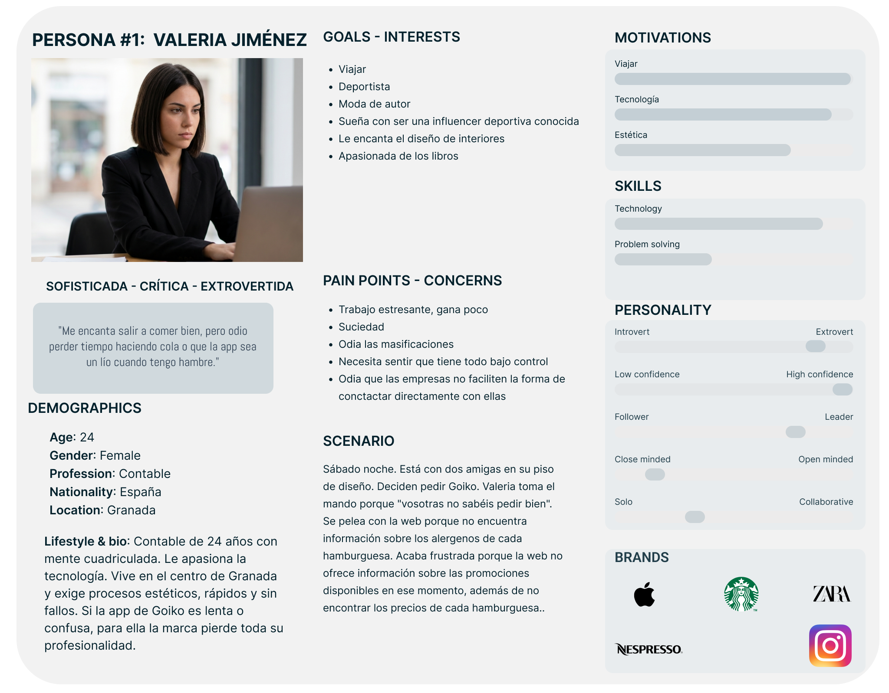
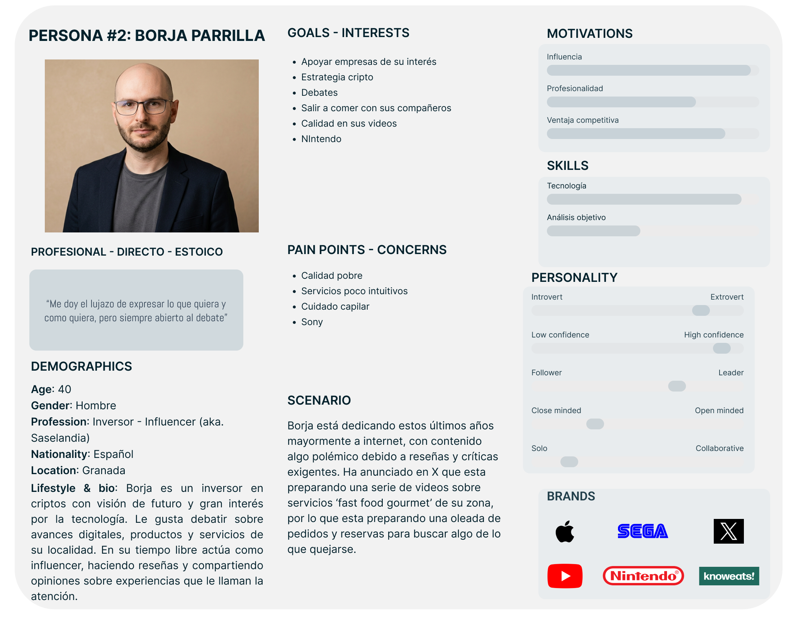
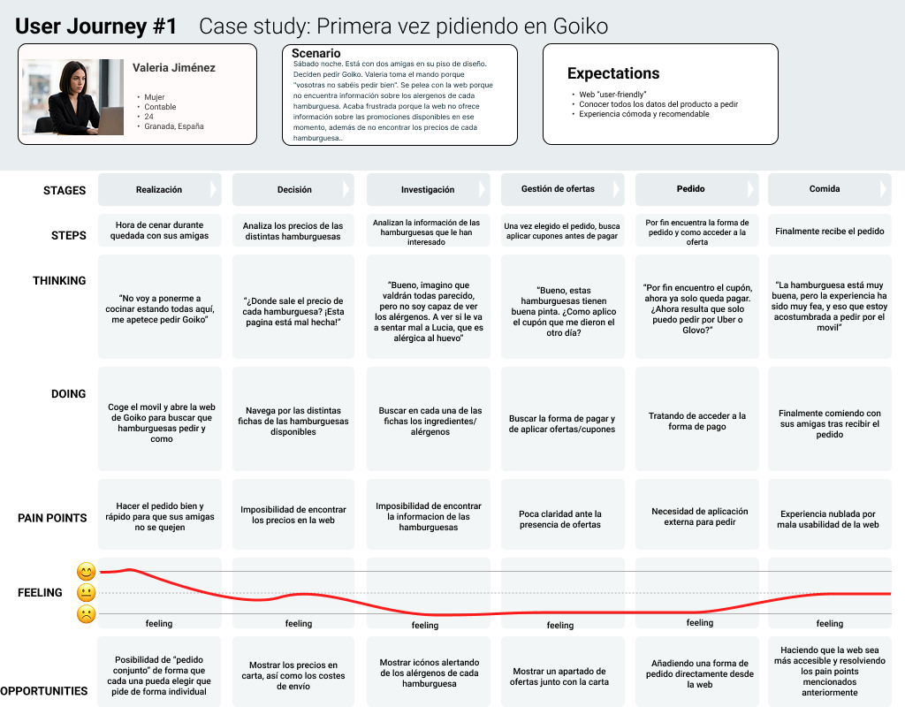
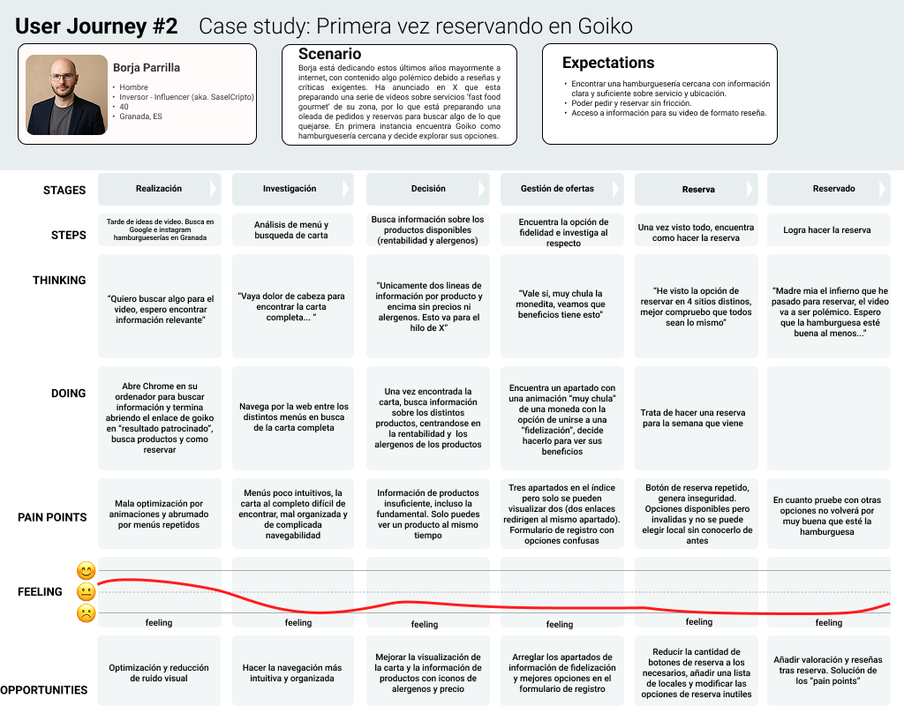
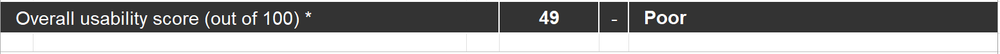

# DIU26

Actualizado: 11/03/2026

Grupo: DIU3_ColesterMax.  Curso: 2025/26 

Nombre del Proyecto: 

>>> Decida el nombre corto de su propuesta en la práctica 2 

Descripción: 

>>> Describa la idea de su producto en la práctica 2 

Logotipo: 

>>> Si diseña un logotipo para su producto en la práctica 3 pongalo aqui, a un tamaño adecuado. Si diseña un slogan añadalo aquí

Miembros y nombre del equipo:
 * :bust_in_silhouette:  David Bacas Posadas     :octocat:     
 * :bust_in_silhouette:  Pablo Hernández Ibáñez     :octocat:

 

# Proceso de Diseño 

 

## Paso 1. UX User & Desk Research & Analisis 

### 1.a User Reseach Plan
-----
#### Briefing

##### 1. Contexto
En los últimos años se ha producido un gran aumento de interés proveniente de la persona común hacia el sector de la comida rápida "gourmet". Basta "scrollear" en las redes sociales o pasear por cualquier ciudad para encontrar locales especializados en el concepto "fast food" al puro estilo estadounidense. Este crecimiento no solo responde a la oferta gastronómica, sino del mismo modo a la experiencia del usuario asociada al consumo, donde un buen diseño del espacio y presencia digital es clave en la actualidad.

##### 2. Problema y objetivos
Ante este incremento considerable de demanda, es necesario comprender lo que realmente buscan los usuarios interesados en este sector. Nuestro objetivo es identificar qué factores pueden incrementar el consumo, así como los elementos que pueden llegar a generar desorientación o frustración al usuario durante la interacción digital. Se pretende analizar los aspectos más valorados por los usuarios y las distintas oportunidades de mejora en comparación con otras propuestas del sector.

##### 3. Procedimiento
Para ello, se emplearán distintos métodos para el análisis. El desarrollo detallado del análisis y planificación se puede consultar en el siguiente documento: [UserResearchPlan.md](./UserResearchPlan.md)

### 1.b Competitive Analysis
-----

Compararemos uno de nuestros restaurantes objeto de estudio (Goiko) con algunos competidores presentes en Granada, como lo son Guifer 2.0 o Mumama:
 

Como podemos observar, Goiko se mantiene en la línea de los competidores en este ámbito, sin embargo, existen otros restaurantes cuyo diseño es más interesante y, desde nuestro punto de vista, acertado a la hora de hacer una página web que trate de mostrar que tienen en carta 

### 1.c Personas 
-----

Vamos a presentar a dos personas con perfiles distintos que encontrarán alguna situación para interactuar con Goiko.

#### Valeria Jiménez

Una mujer sofisticada y crítica. Es una persona social y extrovertida a la que le gusta reunirse con amigos y disfrutar de planes en grupo, aunque siempre valora aprovechar bien su tiempo.

 

#### Borja Parrilla

Hombre con traje, gafas y calvo, interesado en el mundo de las criptomonedas. Tiene un perfil profesional y directo, y suele estar pendiente de oportunidades y planes a futuro. En internet es conocido como SaselCripto, donde crea contenido centrado principalmente en reseñas y críticas sobre distintos temas.

 

### 1.d User Journey Map

A continuación se analizarán dos escenarios distintos, uno por persona, donde se pondrá a prueba la usabilidad de Goiko en nuevos usuarios.

#### Valeria Jiménez: Primera vez pidiendo en Goiko

El escenario es el siguiente: *"Sábado noche. Está con dos amigas en su piso de diseño. Deciden pedir Goiko. Valeria toma el mando porque "vosotras no sabéis pedir bien". Se pelea con la web porque no encuentra información sobre los alérgenos de cada hamburguesa. Acaba frustrada porque la web no ofrece información sobre las promociones disponibles en ese momento, además de no encontrar los precios de cada hamburguesa."*

En este escenario encontramos una situación habitual: una "cena con amigas". Se refleja perfectamente cómo Valeria, una usuaria cualquiera con exigencias, llega a frustrarse al intentar hacer el pedido y usar las promociones de Goiko.

#### Borja Parrilla: Primera vez reservando en Goiko

El escenario es el siguiente: *"Borja está dedicando estos últimos años mayormente a internet, con contenido algo polémico debido a reseñas y críticas exigentes. Ha anunciado en X que está preparando una serie de videos sobre “fast food gourmet” de su zona, por lo que está preparando una oleada de pedidos y reservas para buscar algo de lo que quejarse. En primera instancia encuentra Goiko como hamburguesería cercana y decide explorar sus opciones."*

En este escenario se presenta una situación no tan cotidiana, donde un creador de contenido busca alguna pega o un muy buen servicio para hacer un video al respecto. Borja, centrado en internet y en reseñas exigentes, es este creador de contenido que busca material sobre “fast food gourmet”. Su frustración potencial surge al explorar Goiko, ya que espera información clara y completa y una experiencia mas o menos amena para reservar.

### 1.e Usability Review

Se ha realizado el siguiente **Usability Review** sobre Goiko:

- [PDF](./P1/Realizacion/Usability-review-Goiko.pdf)
- [Excel](./P1/Realizacion/Usability-review-Goiko.xls)

La pagina web de Goiko ha obtenido un 49 sobre 100, con la valoración: ***Poor***

La página de Goiko cuenta con una buena estética y, aunque dependa de gustos, está claro que, una vez haces tu primer clic para acceder a la página principal, sabes de qué va a ir el tema desde el primer momento. Nada más entrar, te encuentras con un video de una hamburguesa girando junto con bastantes logotipos y arte de fondo relacionado con el entorno 'fast food'. Y, aunque lo nombrado sea positivo, se ve rápido que no está bien optimizada: el video y las animaciones presentes, como la de la moneda, parecen afectar bastante al rendimiento de la página, teniendo que esperar más de lo normal en la mayoría de casos.

Del mismo modo, podemos nombrar la vaga organización que tiene la página. El mero hecho de buscar en la carta ya es difícil, pero a la hora de navegar es aún peor. Encontramos una navegabilidad sin jerarquía clara que puede llegar a desorientar al usuario: al entrar en la carta, te encuentras un menú por cada tipo de producto y, dentro de este, otro submenú con todos los productos de ese tipo que, al clicar, nos lleva a otro menú donde encontramos escasa información sobre ese producto. Es decir, pasas más tiempo clicando y buscando que leyendo ingredientes, aspectos del producto y más información, si es que existe.

Por último, cabe mencionar que las otras opciones, como fidelización o promociones, no se alejan mucho de lo ya mencionado, además de contar con formularios, como el de reserva, con opciones poco intuitivas y sin contar con los mensajes de error necesarios.

Así, queda claro que la página de Goiko sabe expresar su producto y estilo de buena manera, pero se queda corta a la hora de la usabilidad, llegando a desesperar a los usuarios a la hora de realizar una actividad básica en ese tipo de páginas, como ver la carta, hacer una reserva o un pedido de comida.

### 1.f Conclusión

Como comentamos al comienzo de la práctica, nuestro objetivo era análizar las carencias que nuestro restaurante elegido, Goiko, tiene con respecto al estandar de mercado.
Así, hemos comprobado la funcionalidad y accesibilidad de la pagina web principal que posee el restaurante,
análizando en profundidad la facilidad de navegación en esta y la usabilidad de la interfaz que posee.

Como conclusión, y aprovechando para introducir lo que se busca resolver en prácticas posteriores, hemos comprobado que la página de Goiko tiene carencias importantes. Recuerda un poco a un cajón de sastre, podemos encontar todos los elementos necesarios para que una web de un restaurante de hamburguesas funcione correctamente, sin embargo, están organizados de forma cuestionable, llegando incluso a repetir elementos en varias ocasiones a lo largo de la web.

Así, durante la práctica hemos simulado usos cotidianos que los usuarios podrían hacer de la página, y como hemos podido observar, puede llegar a resultar frustante o confuso, nublando la experiencia que ofrece Goiko.

Por todo esto, y dado que vemos que la web tiene potencial, ya sea por su estética, o por que nos parece que el restaurante tiene mucho que ofrecer, trataremos de corregir los errores que hemos ido comentando durante este documento, buscando ofrecer una experiencia más limpia y satisfactoria.

 

## Paso 2. UX Design  

>>> Cualquier título puede ser adaptado. Recuerda borrar estos comentarios del template en tu documento

### 2.a Reframing / IDEACION: Feedback Capture Grid / EMpathy map 
 
----

>>> Comenta con un diagrama los aspectos más destacados a modo de conclusion de la práctica anterior. De qué carece la competencia?? Tu diagrama puede ser una figura subida a la carpeta P2/

 Interesante | Críticas     
| ------------- | -------
  Preguntas | Nuevas ideas
  
    
>>> Explica el Problema y plantea una hipótesis. Es decir, explica aquí qué 
>>> se plantea como "propuesta de valor" para un nuevo diseño de aplicación propio

### 2.b ScopeCanvas

----

>>> Propuesta de valor, pero ahora en vez de un texto es un ScopeCanvas que has subido a P2/ y enlazado desde aqui. Tambien vale una imagen miniatura del recurso.
>>> No olvides que tu propuesta ya tiene un nombre corto y puedes actualizar la cabecera de este archivo

### 2.b User Flow (task) analysis 
 
-----

>>> Definir "User Map" y "Task Flow" ... enlazar desde P2/ y describir brevemente

### 2.c IA: Sitemap + Labelling 
 
----

>>> Identificar términos para diálogo con usuario (evita el spanglish) y la arquitectura de la información. Es muy apropiado un diagrama tipo sitemap y una tabla que se ampliaría para llevar asociado la columna iconos (tanto para la web como para una app). 

Término | Significado     
| ------------- | -------
  Login  | acceder a plataforma

### 2.d Wireframes
 
-----

>>> Plantear el diseño del layout para Web/movil (organización y simulación). Describa la herramienta usada 

 

## Paso 3. Mi UX-Case Study (diseño)

>>> Cualquier título puede ser adaptado. Recuerda borrar estos comentarios del template en tu documento

### 3.a Moodboard

-----

>>> Diseño visual con una guía de estilos visual (moodboard) 
>>> Incluir Logotipo. Todos los recursos estarán subidos a la carpeta P3/
>>> Explique aqui la/s herramienta/s utilizada/s y el por qué de la resolución empleada. Reflexione ¿Se puede usar esta imagen como cabecera de Instagram, por ejemplo, o se necesitan otras?

### 3.b Landing Page
 
----

>>> Plantear el Landing Page del producto. Aplica estilos definidos en el moodboard

### 3.c Guidelines
 
----

>>> Estudio de Guidelines y explicación de los Patrones IU a usar 
>>> Es decir, tras documentarse, muestre las deciones tomadas sobre Patrones IU a usar para la fase siguiente de prototipado. 

### 3.d Mockup
 
----

>>> Consiste en tener un Layout en acción. Un Mockup es un prototipo HTML que permite simular tareas con estilo de IU seleccionado. Muy útil para compartir con stakeholders

 

## Paso 4. Pruebas de Evaluación 

### 4.a Reclutamiento de usuarios 

-----

>>> Breve descripción del caso asignado (llamado Caso-B) con enlace al repositorio Github
>>> Tabla y asignación de personas ficticias (o reales) a las pruebas. Exprese las ideas de posibles situaciones conflictivas de esa persona en las propuestas evaluadas. Mínimo 4 usuarios: asigne 2 al Caso A y 2 al caso B.

| Usuarios | Sexo/Edad     | Ocupación   |  Exp.TIC    | Personalidad | Plataforma | Caso
| ------------- | -------- | ----------- | ----------- | -----------  | ---------- | ----
| User1's name  | H / 18   | Estudiante  | Media       | Introvertido | Web.       | A 
| User2's name  | H / 18   | Estudiante  | Media       | Timido       | Web        | A 
| User3's name  | M / 35   | Abogado     | Baja        | Emocional    | móvil      | B 
| User4's name  | H / 18   | Estudiante  | Media       | Racional     | Web        | B 

### 4.b Diseño de las pruebas 
 
-----

>>> Planifique qué pruebas se van a desarrollar. ¿En qué consisten? ¿Se hará uso del checklist de la P1?

### 4.c Cuestionario SUS
 
----

>>> Como uno de los test para la prueba A/B testing, usaremos el **Cuestionario SUS** que permite valorar la satisfacción de cada usuario con el diseño utilizado (casos A o B). Para calcular la valoración numérica y la etiqueta linguistica resultante usamos la [hoja de cálculo](https://github.com/mgea/DIU19/blob/master/Cuestionario%20SUS%20DIU.xlsx). Previamente conozca en qué consiste la escala SUS y cómo se interpretan sus resultados
http://usabilitygeek.com/how-to-use-the-system-usability-scale-sus-to-evaluate-the-usability-of-your-website/)
Para más información, consultar aquí sobre la [metodología SUS](https://cui.unige.ch/isi/icle-wiki/_media/ipm:test-suschapt.pdf)
>>> Adjuntar en la carpeta P4/ el excel resultante y describa aquí la valoración personal de los resultados 

### 4.d A/B Testing
 
-----

>>> Los resultados de un A/B testing con 3 pruebas y 2 casos o alternativas daría como resultado una tabla de 3 filas y 2 columnas, además de un resultado agregado global. Especifique con claridad el resultado: qué caso es más usable, A o B?

### 4.e Aplicación del método Eye Tracking 

----

>>> Indica cómo se diseña el experimento y se reclutan los usuarios. Explica la herramienta / uso de gazerecorder.com u otra similar. Aplíquese únicamente al caso B.

  
>>> Cambiar esta img por una de vuestro experimento. El recurso deberá estar subido a la carpeta P4/  

>>> gazerecorder en versión de pruebas puede estar limitada a 3 usuarios para generar mapa de calor (crédito > 0 para que funcione) 

### 4.f Usability Report de B
 
-----

>>> Añadir report de usabilidad para práctica B (la de los compañeros) aportando resultados y valoración de cada debilidad de usabilidad. 
>>> Enlazar aqui con el archivo subido a P4/ que indica qué equipo evalua a qué otro equipo.

>>> Complementad el Case Study en su Paso 4 con una Valoración personal del equipo sobre esta tarea

 

## Paso 5. Exportación y Documentación 

### 5.a Exportación a HTML/React
 
----

>>> Breve descripción de esta tarea. Las evidencias de este paso quedan subidas a P5/

### 5.b Documentación con Storybook

----

>>> Breve descripción de esta tarea. Las evidencias de este paso quedan subidas a P5/

 

## Conclusiones finales & Valoración de las prácticas

>>> Opinión FINAL del proceso de desarrollo de diseño siguiendo metodología UX y valoración (positiva /negativa) de los resultados obtenidos. ¿Qué se puede mejorar? Recuerda que este tipo de texto se debe eliminar del template que se os proporciona 

