# DIU26

Actualizado: 11/03/2026

Grupo: DIU3_ColesterMax. Curso: 2025/26

Nombre del Proyecto:

> > > Goiko Finder

Descripción:

> > > Encuentra tus platos favoritos, ingredientes o tu restaurante Goiko más cercano en un instante. Todo lo que buscas para calmar el hambre, en un solo lugar.

Logotipo:
<br>
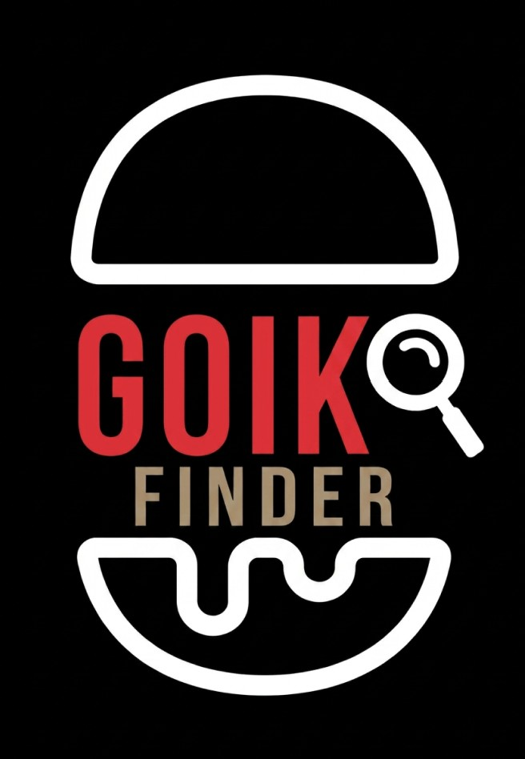
<br>
<br>
Miembros y nombre del equipo:

- :bust_in_silhouette: David Bacas Posadas :octocat:
- :bust_in_silhouette: Pablo Hernández Ibáñez :octocat:

<br>

# **EVALUACION**

Puedes ver las imagenes para realizar el estudio de A/B testing en [Imagenes A/B testing](#anexo-imagenes-a-evaluar-para-ab-testing)

# Proceso de Diseño

<br>

## Paso 1. UX User & Desk Research & Analisis

### 1.a User Reseach Plan

---

#### Briefing

##### 1. Contexto

En los últimos años se ha producido un gran aumento de interés proveniente de la persona común hacia el sector de la comida rápida "gourmet". Basta "scrollear" en las redes sociales o pasear por cualquier ciudad para encontrar locales especializados en el concepto "fast food" al puro estilo estadounidense. Este crecimiento no solo responde a la oferta gastronómica, sino del mismo modo a la experiencia del usuario asociada al consumo, donde un buen diseño del espacio y presencia digital es clave en la actualidad.

##### 2. Problema y objetivos

Ante este incremento considerable de demanda, es necesario comprender lo que realmente buscan los usuarios interesados en este sector. Nuestro objetivo es identificar qué factores pueden incrementar el consumo, así como los elementos que pueden llegar a generar desorientación o frustración al usuario durante la interacción digital. Se pretende analizar los aspectos más valorados por los usuarios y las distintas oportunidades de mejora en comparación con otras propuestas del sector.

##### 3. Procedimiento

Para ello, se emplearán distintos métodos para el análisis. El desarrollo detallado del análisis y planificación se puede consultar en el siguiente documento: [UserResearchPlan.md](./UserResearchPlan.md)

### 1.b Competitive Analysis

---

Compararemos uno de nuestros restaurantes objeto de estudio (Goiko) con algunos competidores presentes en Granada, como lo son Guifer 2.0 o Mumama:


Como podemos observar, Goiko se mantiene en la línea de los competidores en este ámbito, sin embargo, existen otros restaurantes cuyo diseño es más interesante y, desde nuestro punto de vista, acertado a la hora de hacer una página web que trate de mostrar que tienen en carta

### 1.c Personas

---

Vamos a presentar a dos personas con perfiles distintos que encontrarán alguna situación para interactuar con Goiko.

#### Valeria Jiménez

Una mujer sofisticada y crítica. Es una persona social y extrovertida a la que le gusta reunirse con amigos y disfrutar de planes en grupo, aunque siempre valora aprovechar bien su tiempo.

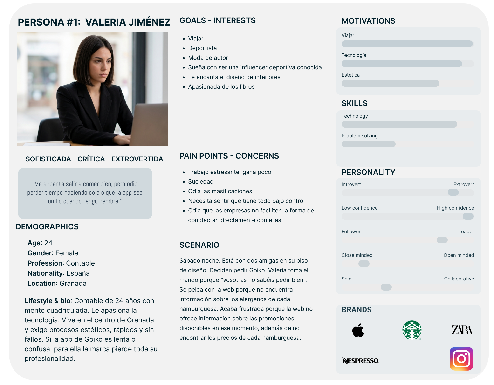

#### Borja Parrilla

Hombre con traje, gafas y calvo, interesado en el mundo de las criptomonedas. Tiene un perfil profesional y directo, y suele estar pendiente de oportunidades y planes a futuro. En internet es conocido como SaselCripto, donde crea contenido centrado principalmente en reseñas y críticas sobre distintos temas.

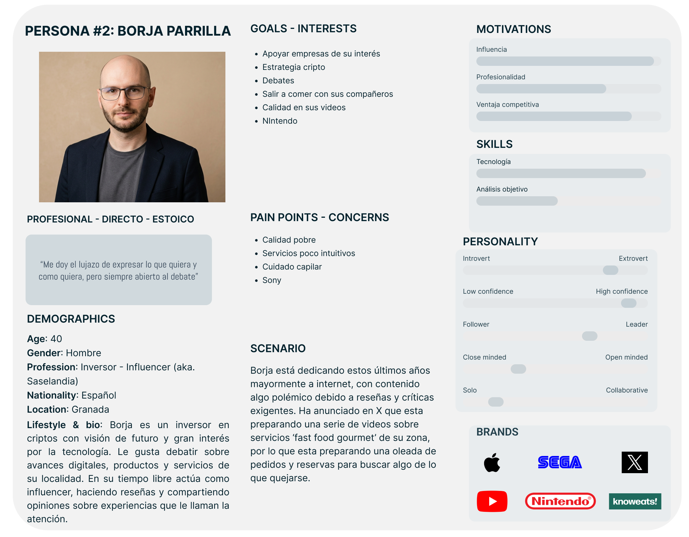

### 1.d User Journey Map

A continuación se analizarán dos escenarios distintos, uno por persona, donde se pondrá a prueba la usabilidad de Goiko en nuevos usuarios.

#### Valeria Jiménez: Primera vez pidiendo en Goiko

El escenario es el siguiente: _"Sábado noche. Está con dos amigas en su piso de diseño. Deciden pedir Goiko. Valeria toma el mando porque "vosotras no sabéis pedir bien". Se pelea con la web porque no encuentra información sobre los alérgenos de cada hamburguesa. Acaba frustrada porque la web no ofrece información sobre las promociones disponibles en ese momento, además de no encontrar los precios de cada hamburguesa."_

En este escenario encontramos una situación habitual: una "cena con amigas". Se refleja perfectamente cómo Valeria, una usuaria cualquiera con exigencias, llega a frustrarse al intentar hacer el pedido y usar las promociones de Goiko.

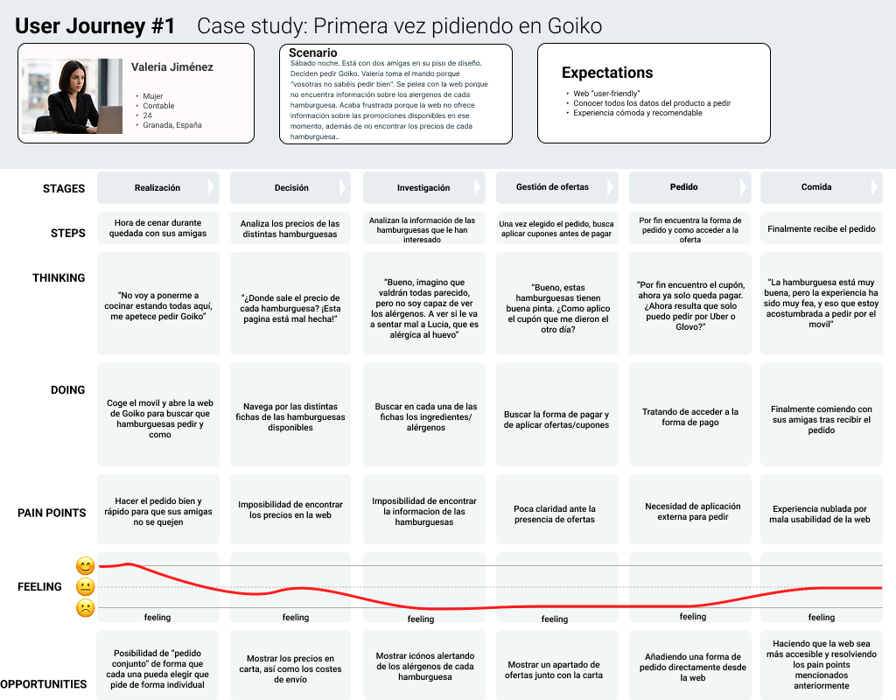

#### Borja Parrilla: Primera vez reservando en Goiko

El escenario es el siguiente: _"Borja está dedicando estos últimos años mayormente a internet, con contenido algo polémico debido a reseñas y críticas exigentes. Ha anunciado en X que está preparando una serie de videos sobre “fast food gourmet” de su zona, por lo que está preparando una oleada de pedidos y reservas para buscar algo de lo que quejarse. En primera instancia encuentra Goiko como hamburguesería cercana y decide explorar sus opciones."_

En este escenario se presenta una situación no tan cotidiana, donde un creador de contenido busca alguna pega o un muy buen servicio para hacer un video al respecto. Borja, centrado en internet y en reseñas exigentes, es este creador de contenido que busca material sobre “fast food gourmet”. Su frustración potencial surge al explorar Goiko, ya que espera información clara y completa y una experiencia mas o menos amena para reservar.

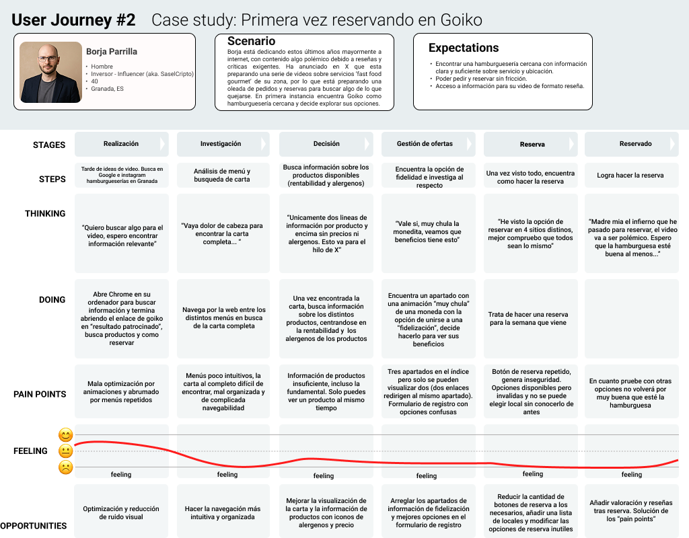

### 1.e Usability Review

Se ha realizado el siguiente **Usability Review** sobre Goiko:

- [PDF](./P1/Realizacion/Usability-review-Goiko.pdf)
- [Excel](./P1/Realizacion/Usability-review-Goiko.xls)

La pagina web de Goiko ha obtenido un 49 sobre 100, con la valoración: **_Poor_**

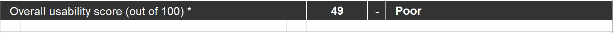

La página de Goiko cuenta con una buena estética y, aunque dependa de gustos, está claro que, una vez haces tu primer clic para acceder a la página principal, sabes de qué va a ir el tema desde el primer momento. Nada más entrar, te encuentras con un video de una hamburguesa girando junto con bastantes logotipos y arte de fondo relacionado con el entorno 'fast food'. Y, aunque lo nombrado sea positivo, se ve rápido que no está bien optimizada: el video y las animaciones presentes, como la de la moneda, parecen afectar bastante al rendimiento de la página, teniendo que esperar más de lo normal en la mayoría de casos.

Del mismo modo, podemos nombrar la vaga organización que tiene la página. El mero hecho de buscar en la carta ya es difícil, pero a la hora de navegar es aún peor. Encontramos una navegabilidad sin jerarquía clara que puede llegar a desorientar al usuario: al entrar en la carta, te encuentras un menú por cada tipo de producto y, dentro de este, otro submenú con todos los productos de ese tipo que, al clicar, nos lleva a otro menú donde encontramos escasa información sobre ese producto. Es decir, pasas más tiempo clicando y buscando que leyendo ingredientes, aspectos del producto y más información, si es que existe.

Por último, cabe mencionar que las otras opciones, como fidelización o promociones, no se alejan mucho de lo ya mencionado, además de contar con formularios, como el de reserva, con opciones poco intuitivas y sin contar con los mensajes de error necesarios.

Así, queda claro que la página de Goiko sabe expresar su producto y estilo de buena manera, pero se queda corta a la hora de la usabilidad, llegando a desesperar a los usuarios a la hora de realizar una actividad básica en ese tipo de páginas, como ver la carta, hacer una reserva o un pedido de comida.

### 1.f Briefing final

Como comentamos al comienzo de la práctica, nuestro objetivo era análizar las carencias que nuestro restaurante elegido, Goiko, tiene con respecto al estandar de mercado.
Así, hemos comprobado la funcionalidad y accesibilidad de la pagina web principal que posee el restaurante,
análizando en profundidad la facilidad de navegación en esta y la usabilidad de la interfaz que posee.

Como conclusión, y aprovechando para introducir lo que se busca resolver en prácticas posteriores, hemos comprobado que la página de Goiko tiene carencias importantes. Recuerda un poco a un cajón de sastre, podemos encontar todos los elementos necesarios para que una web de un restaurante de hamburguesas funcione correctamente, sin embargo, están organizados de forma cuestionable, llegando incluso a repetir elementos en varias ocasiones a lo largo de la web.

Así, durante la práctica hemos simulado usos cotidianos que los usuarios podrían hacer de la página, y como hemos podido observar, puede llegar a resultar frustante o confuso, nublando la experiencia que ofrece Goiko.

Por todo esto, y dado que vemos que la web tiene potencial, ya sea por su estética, o por que nos parece que el restaurante tiene mucho que ofrecer, trataremos de corregir los errores que hemos ido comentando durante este documento, buscando ofrecer una experiencia más limpia y satisfactoria.

<br>

## Paso 2. UX Design

### 2.a Reframing / IDEACION: Feedback Capture Grid / EMpathy map

#### Empathy Mapping

Para poder sacar conclusiones sobre que problema debemos de afrontar a la hora de realizar nuestra mejora de la web, debemos analizar como ha sido la experiencia de uso de las dos personas análizadas durante la práctica anterior, de forma que comprendamos como se han sentido durante el uso de esta:


Así, podemos sacar dos conclusiones:

- Aunque al usuario le gusta la marca, la web es muy lenta y laberintica, lo que nubla bastante la experiencia del restaurante.
- Existe una falta de información clara. Hay una gran dificultad para encontrar alérgenos, precios, etc.

#### Feedback Capture Grid

Podemos representar las conclusiones en el siguiente gráfico, de forma que nos sirva para ajustar el enfoque que va a tomar nuestra solución:

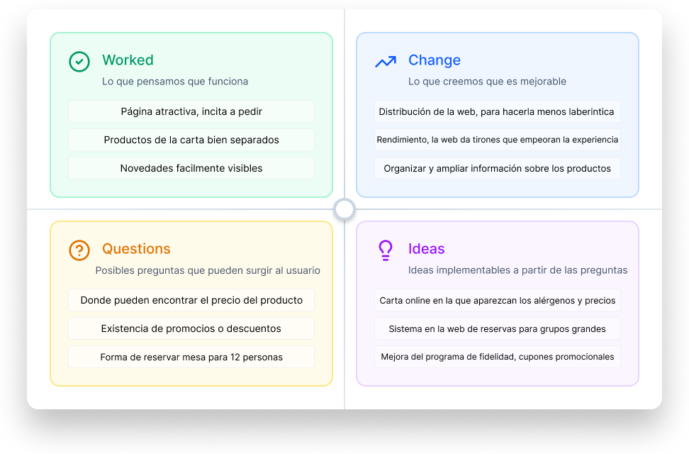

### 2.b ScopeCanvas

Hemos decidido que una solución práctica y efectiva a nuestro problema sería un Buscador/HUB que permita al cliente acceder a todo lo que necesite en el meno número de clicks posibles, además de ofrecer una experiencia interáctiva para aquellos clientes que entren a la web de forma recurrente, registrando sus funciones más usadas y tratando de análizar sus gustos para proporcionarle recomendaciones acertadas.

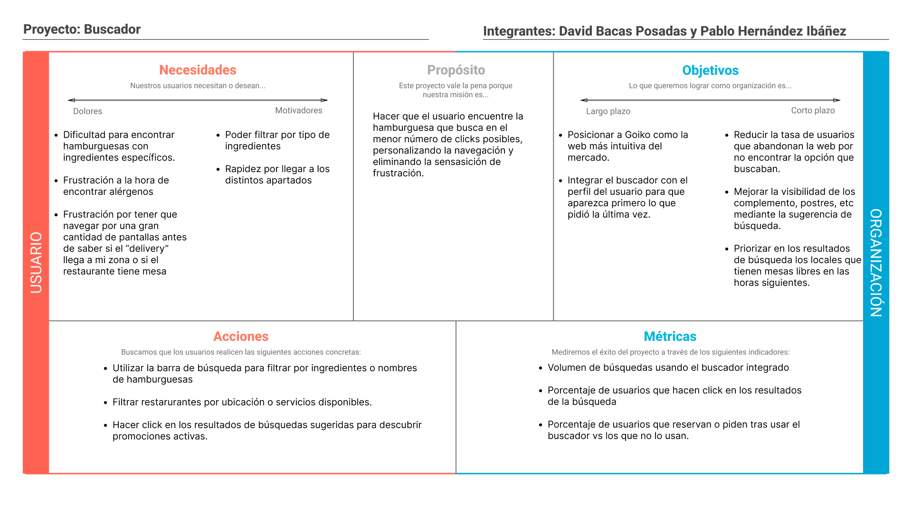

El Scope Canvas define al buscador como el eje central para mejorar la UX de Goiko. Al atacar directamente los puntos de dolor (lentitud y falta de información), transformamos una necesidad técnica en una ventaja competitiva: una web intuitiva que prioriza el tiempo del cliente y maximiza las oportunidades de venta para el negocio.

### 2.b User Flow (task) analysis

#### Task Matrix

En nuestra matriz de tareas de usuario, hemos recopilado las funciones principales que el buscador/HUB debe ofrecer para mitigar la lentitud y la falta de información detectadas. Hemos definido tres grupos clave basados en las **Personas** de la P1 y los roles del sistema, asignando prioridades de **Alta (H)**, **Media (M)** y **Baja (L)**, o usando un guión **(-)** si la acción no aplica.

| Acción / Función                                | Cliente Ocasional (Valeria) | Crítico / Influencer (Borja) | Administrador |
| :---------------------------------------------- | :-------------------------: | :--------------------------: | :-----------: |
| **Búsqueda rápida de alérgenos y filtros**      |              H              |              H               |       L       |
| **Consultar precios actualizados por local**    |              H              |              H               |       M       |
| **Buscador de restaurantes cercanos**           |              H              |              M               |       -       |
| **Reserva de mesa rápida e intuitiva**          |              M              |              H               |       L       |
| **Visualización de carta (interactiva/rápida)** |              H              |              H               |       M       |
| **Acceso a promociones y cupones activos**      |              H              |              M               |       M       |
| **Gestión de perfiles y preferencias de dieta** |              M              |              H               |       L       |
| **Realizar pedido**                             |              H              |              M               |       -       |
| **Consultar historial de pedidos/reseñas**      |              L              |              H               |       L       |
| **Publicar ofertas temporales o locales**       |              -              |              -               |       H       |

Para mostrar el funcionamiento amigable del HUB, hemos querido representar el flujo de dos tareas que suelen ser comunes entre los usuarios: la reserva para grupos grandes y la realización de pedidos ya efectuados anteriormente.

#### Reserva para grupos grandes:

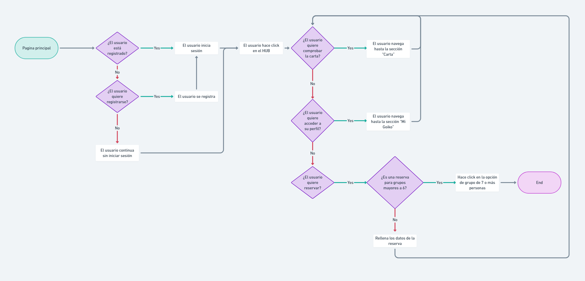

#### Pedidos efectuados anteriormente:

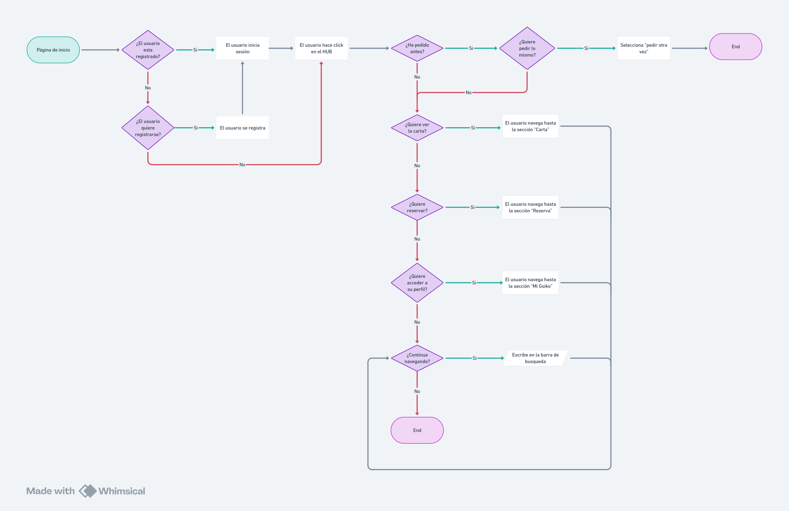

### 2.c IA: Sitemap + Labelling

Asi quedaría la navegación por nuestro sistema: Se ha querido indicar la estructura del _HUB_, del mismo modo, como hijos de este tenemos algunas de las funciones nuevas, como **Historial** o **Favoritos** con sus propias opciones, junto con las nuevas ópciones del perfil de Goiko **Mi Goiko**, donde con la implementación del _HUB_ podrás gestionar tus favoritos y tu historial de busqueda.
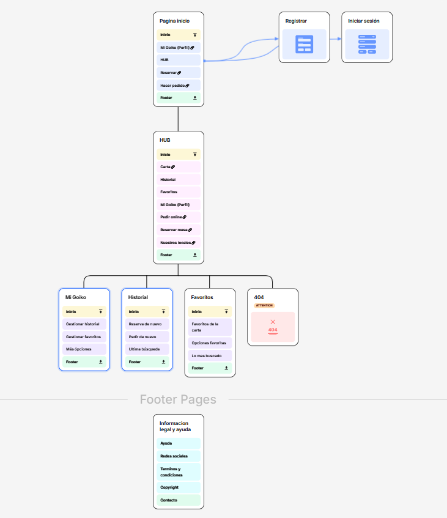

| Término               | Significado                                                                                              |
| --------------------- | -------------------------------------------------------------------------------------------------------- |
| HUB                   | Nodo central. Aqui estará toda la información de Goiko                                                   |
| Favoritos de la carta | Productos guardados que estén en la carta                                                                |
| Opciones favoritas    | Servicios que ofrece Goiko (ej. reserva, pedido, etc)                                                    |
| Reserva de nuevo      | Botón rapido para repetir una reserva en el mismo local y con el mismo numero de personas (configurable) |
| Pedir de nuevo        | Botón rápido de realización del último pedido o uno reciente                                             |
| Mi Goiko              | Perfil de Goiko, donde se podrán gestionar algunas configuraciones del HUB                               |

### 2.d Wireframes

#### Esbozo a papel

En primer lugar, se ha realizado un esbozo en papel, donde, de forma sencilla, se ha marcado la estructura del espacio que se va a realizar. Las zonas nuevas o más destacadas se han señalado con letras, las cuales serán explicadas más adelante.

Se ha de decir que este no será el resultado final, si no el boceto a papel que se ha decidido usar para guiarnos al usar _FIGMA_, por lo que puede que el resultado o alguna distribución se vea ligeramente alterado mas adelante en el wireframe.

.jpg>)

Los elementos que encontramos son:

- A: Barra de búsqueda del HUB.
- B: Filtros de búsqueda (ej. precio, alergenos, ingredientes, etc).
- C: Lo último visitado/pedido por el usuario.
- D: Toda la información, será filtrada al usar los elementos A y B.
- E: Marcados como favoritos por el usuario.
- F: Otras opciones (ej. reservar, pedir, ver locales, etc).
- G: Promociones, podrán cambiar según el usuario.

#### Wireframe (FIGMA)

Una vez planteado el boceto a papel, realizamos su interpretación en figma en el formato que se nos requeria (Grid de 12 columnas).

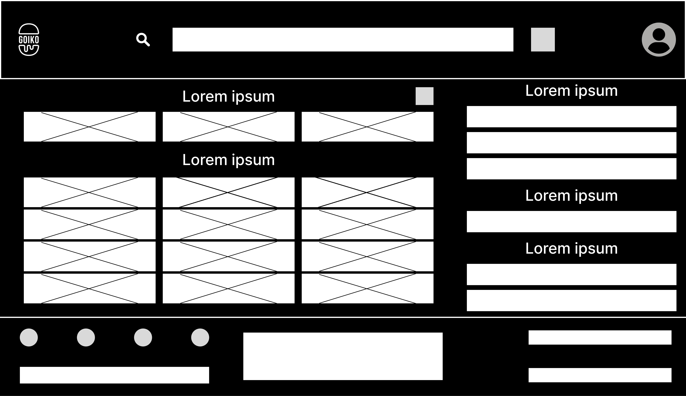

#### GRID LAYOUT

En la siguiente imagen podemos observar la distrubución en el Grid que hemos realizado para el apartado anterior:

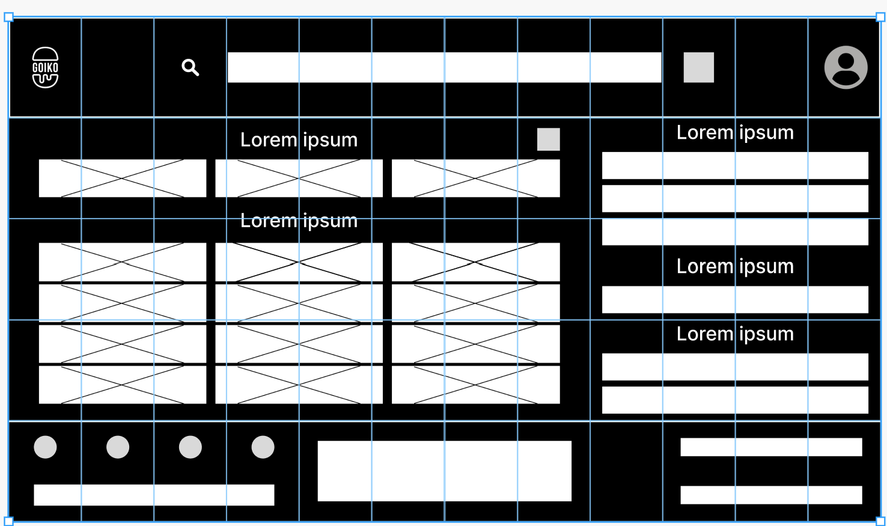

### 2.e Conclusión

Con esta propuesta hemos logrado eliminar las barreras entre el hambre del cliente y la hamburguesa. Al analizar la frustración de los usuarios, vimos que la web actual era un laberinto que penalizaba la marca; con el nuevo HUB central, transformamos esa confusión en eficiencia pura. Ahora, el usuario no tiene que buscar la información, sino que esta le llega de forma intuitiva mediante filtros inteligentes y accesos directos a sus favoritos. En definitiva, hemos pasado de un folleto lento a una herramienta personal que prioriza el tiempo del cliente, convirtiendo la facilidad de uso en el mejor aliado de las ventas de Goiko.

<br>

## Paso 3. Mi UX-Case Study (diseño)

> > > Cualquier título puede ser adaptado. Recuerda borrar estos comentarios del template en tu documento

### 3.a Moodboard

Se ha desarrollado un moodboard de Goiko Finder que recoge colores corporativos, tipografías, texturas y referencias visuales de la experiencia de consumo en restaurantes. Este recurso sirve de base para mantener coherencia estética, estado de ánimo y la identidad visual del proyecto en las siguientes fases de diseño.

#### Moodboard GoikoFinder

.png>)

### 3.b Landing Page

Partiendo del moodboard anterior, hemos desarrollado la siguiente Landing Page aplicando todo lo diseñado anteriormente, con ayuda de Figma Make.


Puedes acceder a ella en el siguiente enlace:

[Landing Page Goiko Find](https://visor-fabric-08824324.figma.site)

### 3.c Design System

Una vez realizada la landing page usando Figma Make, debemos crear un design system ligero.

#### Foundations

Para ello, primero hemos creado las "Foundations" de nuestra organización, de forma que nos permita crear una idéntidad visual consistente y marcada.

Constan de lo siguiente:

- **Tipografía:** Los diferentes estilos de fuente.

- **Colores:** La paleta de la marca.

- **Iconos:** El icono de la estrella, el reloj, el calendario en el botón de reserva, los iconos de redes sociales del footer, todos los necesarios para una buena organización visual.

Todos estos elementos se pueden ver en las siguientes imagenes:

#### Iconos

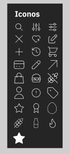

#### Colores y Tipografía

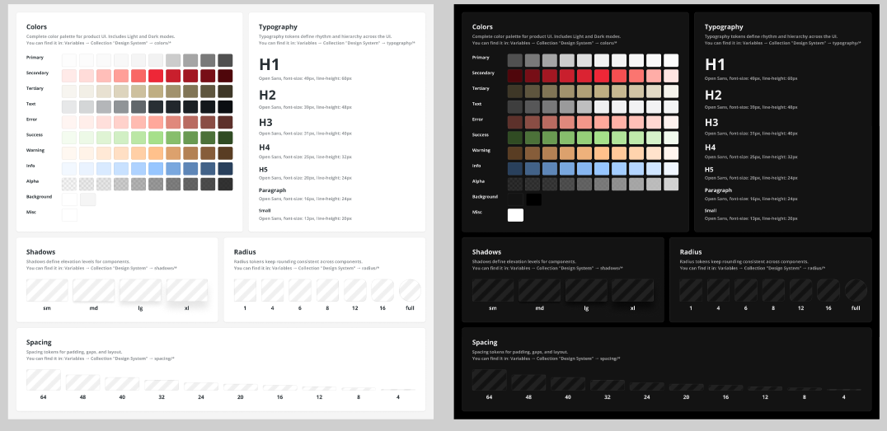

#### Atomic design

Partiendo de la idéntidad creada anteriormente, debemos definir todos los **átomos/moleculas/organismos** que han sido utilizados anteriormente por Figma Make para crear la landing page.

##### Átomos

Son las unidades mínimas e indivisibles de la interfaz. En nuestro caso serán:

- Botones rectangulares: Que permitirán la navegación por nuestra web.

- Botón de icono: Que permitirá acceder al perfil, redes, etc.

- Imágenes: Las fotografías individuales de las hamburguesas y los locales.

- Icono de Usuario: Cuadrado con el icono del usuario, realmente podria ser un botón de icono pero su estructura es distinta.

- Labels: Todos los tipos de _labels_ que se encontrarán en el resto de elementos.

- Iconos: Los [Iconos](#iconos) previamente definidos tambien son átomos.

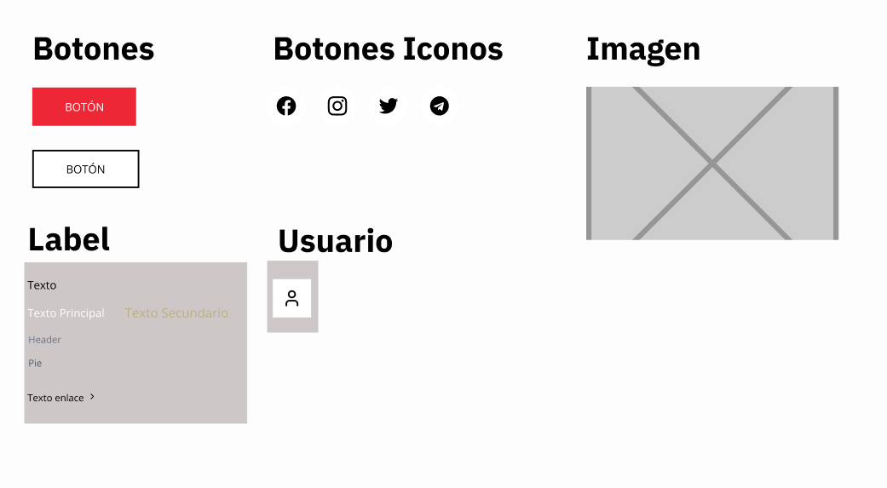

##### Moléculas

Es la unión de dos o más átomos que forman una unidad funcional simple. En nuestro caso serán:

- Botones compuestos: Otro tipo de botones serían aquellos que incluyen un icono, formando asi parte de las moleculas y permitiendo una guia visual para el usuario.

- Filtros: Botones compuestos en otra disposición.

- Barra de Navegacion: Barra formada por un icono y un label que permite la navegación por la web.

- Tarjetas simples y complejas: Tarjetas de información formada por distintos átomos.

- Rating: Icono mas label para el rating de hamburguesas.

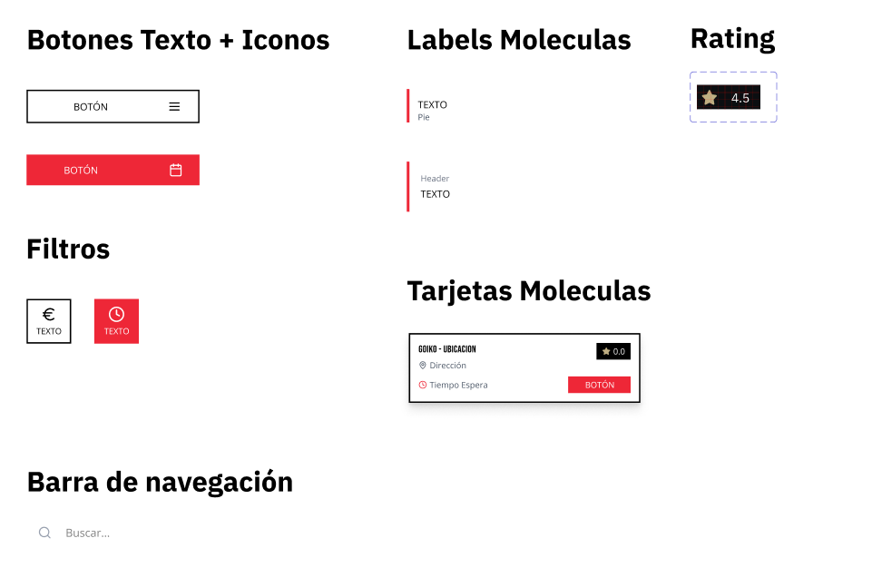

##### Organismos

Grupos de moléculas y/o átomos que forman una sección compleja y distintiva de la interfaz. En nuestro caso serán:

- Tarjetas: Desde las tarjetas de información formada por listas de moleculas hasta tarjetas descriptivas de restuarantes y hamburguesas que ofrecerán información de dicho producto/servicio.

- Mapa: La landing page cuenta con un mapa de locales cercanos formado por una lista de tarjetas moleculares y átomos añadidos en su diseño.

- Header y Footer: Podemos contar el header y el footer como organismos.

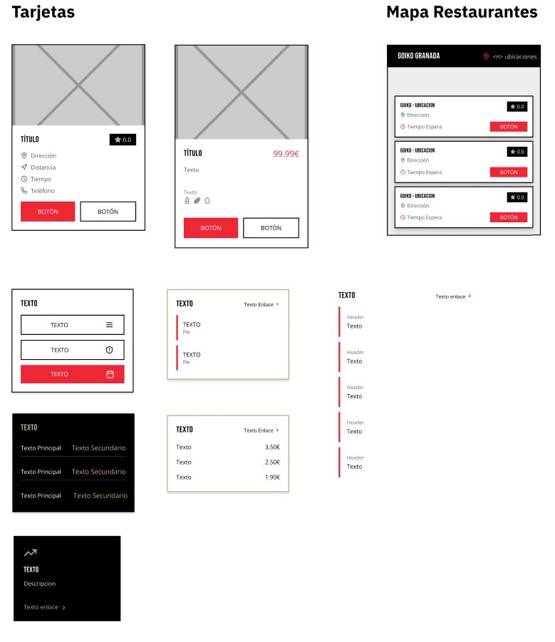

### 3.d Mockup

El prototipo final de **Goiko Finder** se ha diseñado como un **HUB centralizado** que elimina la navegación laberíntica de la web original. Se prioriza la carga rápida de elementos y el acceso directo a la información crítica (precios, alérgenos y reservas) mediante una interfaz limpia y estructurada.

Se ha de destacar que estos son prototipos no finales, los resultados se encuentran en la seccion para la [evaluación A/B testing](#anexo-imagenes-a-evaluar-para-ab-testing). A continuación, se presentan las capturas del Layout en acción:

#### 1. HUB Principal

Es el eje del proyecto. Integra en una sola vista las tendencias del día, acceso rápido a servicios, buscador global y un feed de actualizaciones en tiempo real (restaurantes disponibles, nuevos platos, etc).

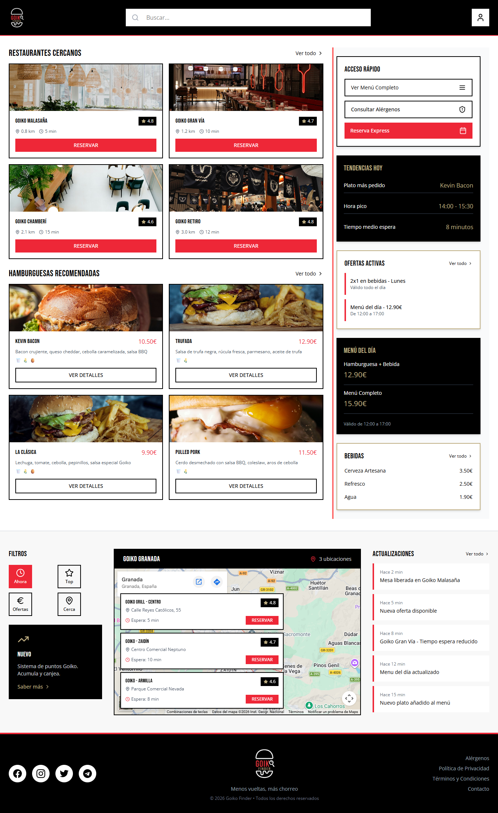

#### 2. Localizador de Restaurantes

Se ha simplificado la visualización de locales, mostrando de forma clara la distancia, el tiempo de espera estimado, rating según antiguos clientes, menú de cada local y la posibilidad de realizar una reserva al instante.

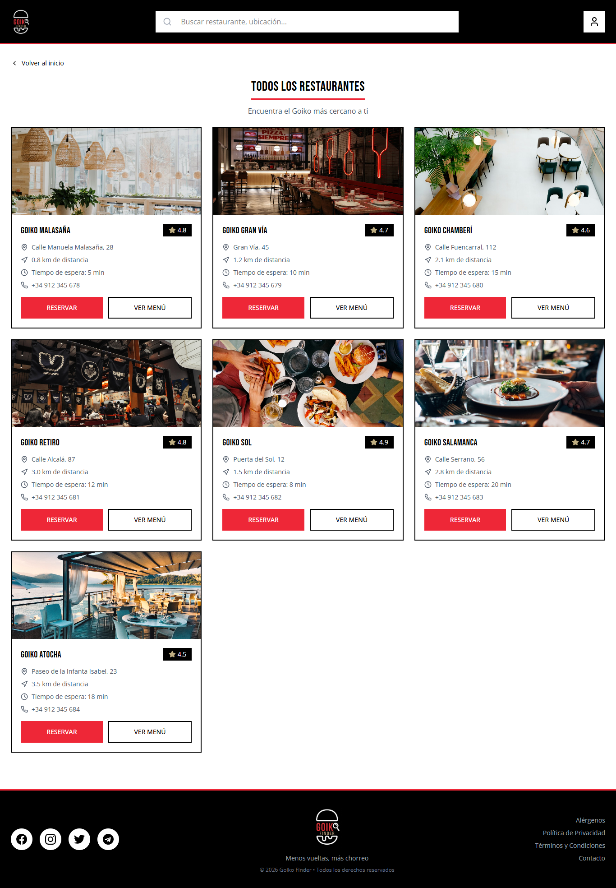

#### 3. Carta de Productos e Ingredientes (Menu de hamburguesas)

La nueva carta permite un filtrado instantáneo por categorías (Veggie, Picantes, Clásicas, etc). Se añade una pestaña nueva para cada hamburguesa, cada una con su descripción, lista de ingredientes, calorias e información interesante para el cliente. Además, agregamos la posibilidad de pedir en un clic la hamburguesa seleccionada, evitando navegación o clics innecesarios del cliente.

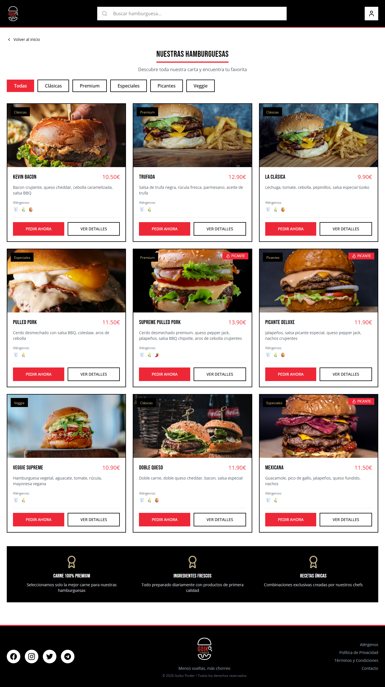

#### 4. Selección de Menús y Complementos

Vista detallada de las opciones de menú y la lista de precios de bebidas y complementos, organizada para facilitar la toma de decisiones rápida durante el proceso de pedido. En este menún no se busca el apartado visual, si no un sitio donde se pueda encontrar lo que el cliente quiere sin andarse con rodeos.


#### 5. Centro de Ofertas y Promociones

Un panel dedicado exclusivamente a las promociones vigentes (2x1, Menú del día, descuentos de estudiante, etc), permitiendo al usuario aplicar cupones directamente a su sesión y estar al dia de las nuevas ofertas de Goiko.

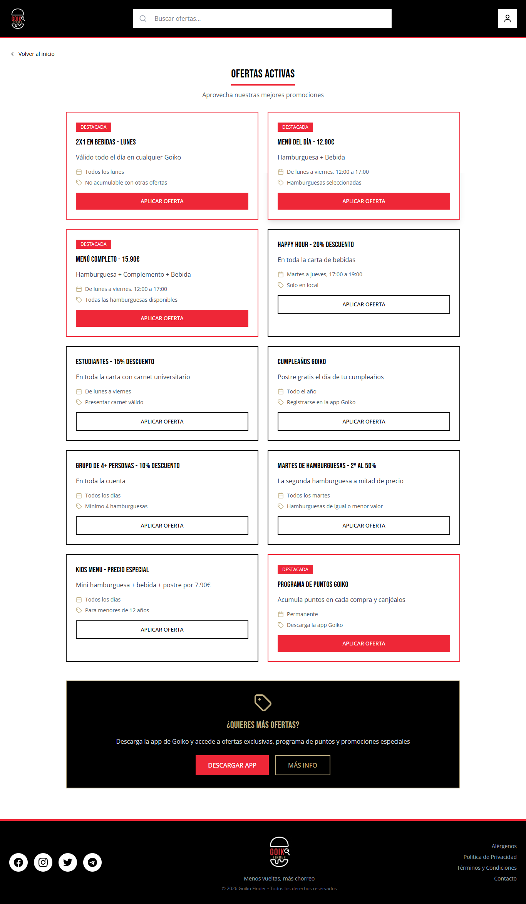

### 3.e Briefing

- **Proceso y Diseño:** Partimos de un Moodboard estético para escalar a un Design System atómico, culminando en un Mockup interactivo. Su gran punto fuerte es transformar la web laberíntica original en un HUB centralizado, permitiendo al usuario acceder en un solo clic a información crítica (precios, alérgenos, ofertas y reservas).

- **Herramientas (IA/Tools):** Utilizamos la IA de Figma Make para autogenerar ágilmente la Landing Page inicial basándose en nuestras directrices visuales, lo que ahorró muchísimo tiempo. A partir de ahí, usamos Figma con total efectividad para desglosar esos elementos en componentes reutilizables y construir el prototipo final.

**Conclusión:** Pasamos de una página lenta y confusa a una herramienta personal ultrarrápida. El diseño ahora prioriza el tiempo del cliente, eliminando la frustración y facilitando directamente las ventas.

<br>

## Paso 4. Componentes UI

### Paso 4.a Crear app react partiendo de Figma Make

Hemos mejorado la aplicación Goiko Finder implementada con Figma Make en la aplicación anterior, refactorizando el codigo para que se usen correctamente los componentes que se han creado usando React. Además, se ha realizado el despliegue mediante la herramienta de publicación de figma, puedes encontrarlo en el siguiente enlace:

[Prototipo final de Goiko Finder](https://visor-fabric-08824324.figma.site)

#### Componente ejemplo RestauranteCard

```javascript
import { MapPin, Clock, Star, Phone, Navigation } from 'lucide-react';
import Button from './Button';

interface RestauranteCardProps {
  name: string;
  distance: string;
  wait: string;
  rating: number;
  img: string;
  address?: string;
  phone?: string;
  onReservar?: () => void;
  onVerMenu?: () => void;
  showButtons?: boolean;
}

export default function RestauranteCard({
  name,
  distance,
  wait,
  rating,
  img,
  address,
  phone,
  onReservar,
  onVerMenu,
  showButtons = false
}: RestauranteCardProps) {
  return (
    <div className="border-2 border-black hover:border-[#EE2737] transition-all bg-white group">
      <div className="h-48 overflow-hidden">
        
      </div>
      <div className="p-5">
        <div className="flex items-start justify-between mb-3">
          <h3 style={{ fontSize: '1.25rem' }}>{name}</h3>
          <div className="flex items-center gap-1 bg-black text-white px-3 py-1">
            <Star className="w-4 h-4 fill-[#BFAE82] text-[#BFAE82]" />
            <span className="text-sm">{rating}</span>
          </div>
        </div>

        <div className="space-y-2 mb-4 text-sm text-gray-600">
          {address && (
            <div className="flex items-center gap-2">
              <MapPin className="w-4 h-4 flex-shrink-0" />
              <span>{address}</span>
            </div>
          )}
          <div className="flex items-center gap-2">
            <Navigation className="w-4 h-4 flex-shrink-0" />
            <span>{distance} de distancia</span>
          </div>
          <div className="flex items-center gap-2">
            <Clock className="w-4 h-4 flex-shrink-0" />
            <span>Tiempo de espera: {wait}</span>
          </div>
          {phone && (
            <div className="flex items-center gap-2">
              <Phone className="w-4 h-4 flex-shrink-0" />
              <span>{phone}</span>
            </div>
          )}
        </div>

        {showButtons && (
          <div className="flex gap-3">
            <Button
              variant="primary"
              size="md"
              onClick={onReservar}
              className="flex-1"
            >
              RESERVAR
            </Button>
            <Button
              variant="outline"
              size="md"
              onClick={onVerMenu}
              className="flex-1"
            >
              VER MENÚ
            </Button>
          </div>
        )}
      </div>
    </div>
  );
}

```

#### Ejemplo de uso de componente RestauranteCard en la LandingPage

```javascript
<div className="grid grid-cols-1 sm:grid-cols-2 gap-3 sm:gap-4">
  {filteredRestaurantes.map((restaurant, idx) => (
    <RestauranteCard
      key={idx}
      name={restaurant.name}
      distance={restaurant.distance}
      wait={restaurant.wait}
      rating={restaurant.rating}
      img={restaurant.img}
      address={restaurant.address}
      phone={restaurant.phone}
      showButtons={true}
      onReservar={() =>
        window.open("https://www.goiko.com/es/reservas/", "_blank")
      }
      onVerMenu={() => navigate("/menu")}
    />
  ))}
</div>
```

## Paso 5. Pruebas de Evaluación

### 5.a Reclutamiento de usuarios

El proceso de reclutamiento sigue una estrategia mixta que combina co-evaluación con pruebas de usuarios externos:

- **Co-evaluación (grupo de clase):** Al menos **3 participantes** del grupo evaluarán el **Caso A** (nuestra propuesta). Se coordina durante las sesiones de prácticas.
- **Usuarios externos:** **7 participantes adicionales** (familiares, amigos o usuarios potenciales) a quienes se aplica el flujo completo: tareas de interacción, **Eye Tracking** y cuestionario **SUS** sobre el caso asignado (A o B).

| Usuarios   | Sexo/Edad | Ocupación  | Exp.TIC | Relación  | Caso | Visión   |
| ---------- | --------- | ---------- | ------- | --------- | ---- | -------- |
| Fernando   | H / 22    | Estudiante | Alta    | Compañero | A    | Gafas    |
| Yeray      | H / 20    | Estudiante | Alta    | Compañero | A    | Gafas    |
| Ares       | M / 19    | Estudiante | Media   | Pareja    | A    | Gafas    |
| Lucia      | M / 19    | Estudiante | Media   | Pareja    | A    | Gafas    |
| Pablo DLTR | H / 20    | Estudiante | Alta    | Compañero | A    | Correcta |
| David      | H / 22    | Estudiante | Alta    | Creador   | B    | Correcta |
| Pablo      | H / 21    | Estudiante | Alta    | Creador   | B    | Correcta |
| Ares       | M / 19    | Estudiante | Media   | Pareja    | B    | Gafas    |
| Lucia      | M / 19    | Estudiante | Media   | Pareja    | B    | Gafas    |
| Fernando   | H / 22    | Estudiante | Alta    | Compañero | B    | Gafas    |

### 5.b Diseño de las pruebas

La prueba que hemos diseñado para comprobar la usabilidad tanto de nuestro proyecto como del de nuestros compañeros es la siguiente:

#### Protocolo de prueba — Goiko Finder (Caso A / Caso B)

**Duración total estimada:** 20-30 min por participante  
**Materiales:** Ordenador con navegador, GazeMapping + FireShot, enlace al cuestionario SUS (Tally.so)

---

##### Bloque 1 — Evaluación del sitio

Las tareas a realizar serán las siguientes:

| #   | Tarea                                                                            | Éxito si…                                                  |
| --- | -------------------------------------------------------------------------------- | ---------------------------------------------------------- |
| T1  | "Busca una hamburguesa sin huevo en el menú y anota cuáles son sus ingredientes" | Identifica un plato sin huevo y visualiza sus ingredientes |

Almacenando de ella los siguientes datos:

**Registro por tarea:**

| Tarea | Completada | Tiempo     | Comentarios |
| ----- | ---------- | ---------- | ----------- |
| T1    | ☐ Sí ☐ No  | \_\_\_ seg |             |

---

###### Resultados del bloque 1

_(✓ = completada · ✗ = no completada · — = no aplica)_

| Usuario    | Caso | T1 Éxito | T1 Tiempo | Comentarios                                                                     |
| ---------- | ---- | :------: | :-------: | ------------------------------------------------------------------------------- |
| Fernando   | A    |    ✓     | 20.96 seg | Web completa, buen diseño, se puede filtrar                                     |
| Yeray      | A    |    ✓     | 30.3 seg  | No ha visto correctamente el enlace para ver todas las hamburguesas             |
| Pablo DLTR | A    |    ✓     | 46.36 seg | Ha intentado ir a los restaurantes en vez de bajar a ver las hamburguesas       |
| Ares       | A    |    ✓     | 14.45 seg | Ninguna                                                                         |
| Lucia      | A    |    ✓     | 31.30 seg | Pensaba que si pinchaba en la hamburguesa podía verla pero no                   |
| David      | B    |    ✓     | 12.13 seg | No hay vista previa de la hamburguesa, únicamente se describen los ingredientes |
| Pablo      | B    |    —     |     —     | —                                                                               |
| Ares       | B    |    ✓     | 16.01 seg | Ninguna                                                                         |
| Lucia      | B    |    ✓     | 21.92 seg | No están especificados los alérgenos, tenía que leerlo todo                     |
| Fernando   | B    |    ✓     | 13.71 seg | Poca información y escaso contenido                                             |

##### Bloque 2 — Eye Tracking con GazeMapping (5-10 min)

---

### 5.c Cuestionario SUS

Se usará el **Cuestionario SUS (System Usability Scale)** para medir la percepción subjetiva de usabilidad de cada usuario sobre el diseño evaluado (Caso A o B). Pasos:

- **Configuración:** Crear una copia de la plantilla disponible en [Tally.so](https://tally.so/templates/escala-sus-test-de-usabilidad/wAyNNw) y ampliarla con las preguntas demográficas del apartado 5.a.
- **Recogida de datos:** El usuario rellena el cuestionario al finalizar la prueba del sitio. Asegurarse de que entiende cómo responder (escala 1-5).
- **Análisis:** Pegar los datos JSON en **[sus.mixality.de](https://sus.mixality.de/)** para el análisis multivariable comparando ambos casos. Consultar también **[sus.tools](https://sus.tools/)** para la valoración numérica y la etiqueta lingüística.

**Enlace al cuestionario**
Lo encontrarás en el siguiente enlace:

[CUESTIONARIO SUS](https://tally.so/r/ODoODg)

**Datos demográficos** _(rellenar antes de comenzar el cuestionario)_

| Campo           | Respuesta                                |
| --------------- | ---------------------------------------- |
| ID Usuario      |                                          |
| Sexo            | ☐ H ☐ M ☐ Otro                           |
| Edad            |                                          |
| Ocupación       |                                          |
| Experiencia TIC | ☐ Alta ☐ Media ☐ Baja                    |
| Relación        | ☐ Compañero ☐ Pareja ☐ Creador ☐ Externo |
| Caso evaluado   | ☐ A ☐ B                                  |
| Visión          | ☐ Correcta ☐ Gafas ☐ Lentillas           |

**Escala SUS** _(1 = Totalmente en desacuerdo · 5 = Totalmente de acuerdo)_

| #   | Pregunta                                                                                 | 1   | 2   | 3   | 4   | 5   |
| --- | ---------------------------------------------------------------------------------------- | --- | --- | --- | --- | --- |
| 1   | Creo que me gustará visitar con frecuencia este website                                  | ☐   | ☐   | ☐   | ☐   | ☐   |
| 2   | Encontré el website innecesariamente complejo                                            | ☐   | ☐   | ☐   | ☐   | ☐   |
| 3   | Pensé que era fácil utilizar este website                                                | ☐   | ☐   | ☐   | ☐   | ☐   |
| 4   | Creo que necesitaría del apoyo de un experto para recorrer el website                    | ☐   | ☐   | ☐   | ☐   | ☐   |
| 5   | Encontré las funciones del website bastante bien integradas                              | ☐   | ☐   | ☐   | ☐   | ☐   |
| 6   | Pensé que había demasiada inconsistencia en el website                                   | ☐   | ☐   | ☐   | ☐   | ☐   |
| 7   | Imagino que la mayoría de las personas aprenderían muy rápidamente a utilizar el website | ☐   | ☐   | ☐   | ☐   | ☐   |
| 8   | Encontré el website muy grande al recorrerlo                                             | ☐   | ☐   | ☐   | ☐   | ☐   |
| 9   | Me sentí muy confiado en el manejo del website                                           | ☐   | ☐   | ☐   | ☐   | ☐   |
| 10  | Necesito aprender muchas cosas antes de manejarse en el website                          | ☐   | ☐   | ☐   | ☐   | ☐   |

El excel resultado podrá observarse en el siguiente enlace:

### 5.d Eye Tracking

Para continuar con el análisis del Caso B, utilizaremos la aplicación de GazeMapping para analizar los mapas de calor de las distintas paginas de la web:

### 5.e Usability Report de B

#### Evaluación de usabilidad del proyecto AL Burguers

[29/05/2026]

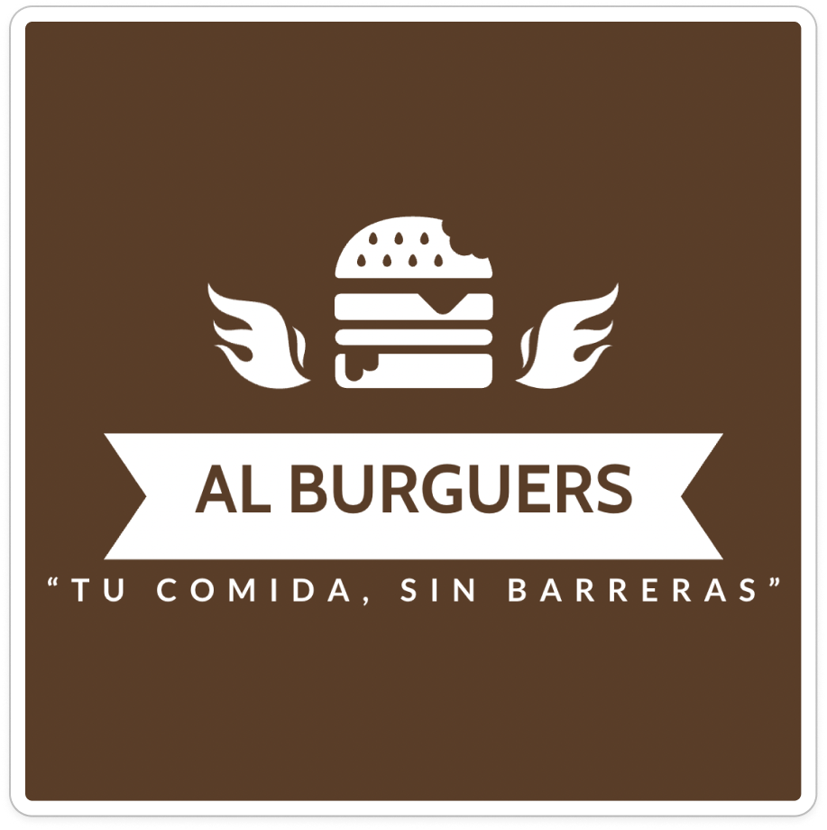


Realizado por: Goiko Finder

#### 1. Resumen Ejecutivo

- **Objetivo:** Evaluar la usabilidad de AL Burguers (Caso B) en el marco del A/B Testing frente a Goiko Finder (Caso A), identificando fortalezas y barreras de uso reales.
- **Metodología:** Tarea supervisada T1 (_"Busca una hamburguesa sin gluten y anota sus ingredientes"_) + Eye Tracking con GazeMapping + cuestionario SUS.
- **Principales Hallazgos:**
  1. **Sin alérgenos integrados en la carta:** los usuarios deben navegar a una sección separada para ver alérgenos, en lugar de verlos junto a cada plato. Lucia (B): _"No están especificados los alérgenos, tenía que leerlo todo"_.
  2. **Sin detalle ni imagen por hamburguesa:** los platos solo muestran ingredientes en texto; no hay página de detalle ni foto individual. David (B): _"No hay vista previa de la hamburguesa, únicamente se describen los ingredientes"_.
  3. **Contenido escaso:** la web transmite poca información general sobre el restaurante. Fernando (B): _"Poca información y escaso contenido"_.
- **Resultado Global:** Caso B completa la tarea con éxito en todos los usuarios evaluados (excepto Pablo, sin dato). Tiempo medio Caso B: **15.9 seg** vs. **28.7 seg** Caso A — AL Burguers es más rápido en la tarea, pero con menor profundidad de contenido. Puntuación SUS: pendiente de análisis (ver sección 3).

#### 2. Metodología y Reclutamiento

- **Perfil de los participantes:** 10 usuarios en total (5 Caso A, 4 datos válidos Caso B). Edad media 20-22 años, todos estudiantes universitarios, nivel TIC mayoritariamente alto. Todos los participantes del Caso B llevan gafas o lentillas (relevante para la calibración de Eye Tracking).
- **Escenario de la prueba:** Tarea única T1 — _"Busca una hamburguesa sin gluten en el menú y anota cuáles son sus ingredientes"_. Flujo esperado en Caso B: Home → círculo ALÉRGENOS o La Carta → ALÉRGENOS → identificar plato sin gluten → volver a La Carta → localizar ingredientes.
- **Herramientas:** GazeMapping + FireShot para Eye Tracking, cuestionario SUS vía Tally.so, registro manual de tiempo de tarea y observaciones del evaluador.

#### 3. Resultados del Cuestionario SUS

_Pendiente de recoger datos reales. Rellenar con los valores exportados de [sus.mixality.de](https://sus.mixality.de/)._

| Usuario          | Caso | Puntuación SUS | Etiqueta |
| ---------------- | ---- | :------------: | -------- |
| David            | B    |                |          |
| Pablo            | B    |       —        | —        |
| Ares             | B    |                |          |
| Lucia            | B    |                |          |
| Fernando         | B    |                |          |
| **Media Caso B** |      |                |          |
| **Media Caso A** |      |                |          |

- **Comparativa A vs. B:** Adjuntar gráfico exportado de [sus.mixality.de](https://sus.mixality.de/).
- **Ítems a vigilar:** Alta puntuación esperada en ítem 3 (_"fácil de utilizar"_, tiempo medio 15.9 seg). Baja en ítem 5 (_"funciones bien integradas"_) por la separación de alérgenos y sin detalle por plato.

#### 4. Análisis de Eye Tracking

Sesiones realizadas con 3 usuarios (David, Jose, Pablo) sobre dos páginas: **Home** y **La Carta**. Capturas rasterizadas con FireShot y analizadas con GazeMapping.

---

##### 4.1 Home (Página Principal)

| Usuario | Heatmap                                                                                  |
| ------- | ---------------------------------------------------------------------------------------- |
| David   |  |
| Jose    |     |
| Pablo   |  |

**Hallazgos Home:**

| POI                                           | Observación real                                                                                                                      |
| --------------------------------------------- | ------------------------------------------------------------------------------------------------------------------------------------- |
| Barra de navegación superior                  | **Hotspot en los 3 usuarios.** Primera zona de fijación. "La Carta" y "Eventos" son los ítems más leídos antes de mirar los círculos. |
| Círculos LA CARTA y EVENTOS (fila superior)   | Alta atención en los 3. Jerarquía visual arriba-abajo funciona correctamente.                                                         |
| Círculos ALÉRGENOS y RESERVAS (fila inferior) | Fijación secundaria y más tardía. Reciben menos atención que los superiores en todos los usuarios.                                    |
| GALERÍA (columna derecha)                     | **Zona de silencio total** en los 3 usuarios. Ninguno fijó la mirada en las fotos de la galería.                                      |
| Panel RESEÑAS (columna izquierda)             | Atención ocasional sobre la reseña activa, pero no sistemática. El texto truncado y el efecto blur no invitan a leer.                 |
| CTA "RESERVAR" (nav, extremo derecho)         | Escasa fijación a pesar del bold. Compite en atención con los círculos centrales y pierde.                                            |

---

##### 4.2 La Carta

| Usuario | Heatmap                                                                          |
| ------- | -------------------------------------------------------------------------------- |
| David   |  |
| Jose    |     |
| Pablo   |  |

**Hallazgos La Carta:**

| POI                                 | Observación real                                                                                                                                             |
| ----------------------------------- | ------------------------------------------------------------------------------------------------------------------------------------------------------------ |
| Hero "LA CARTA" (banner superior)   | **Hotspot intenso** en los 3. Primera zona de fijación — el título y la imagen de fondo absorben la mayor parte de la atención inicial.                      |
| Círculo PRINCIPALES                 | Alta fijación. Es el primer círculo de categoría al que van los usuarios antes de explorar los demás.                                                        |
| Círculo ALÉRGENOS (último, derecha) | **El menos atendido en 2 de 3 usuarios.** Solo Pablo registra fijación notable. Confirma que la información de alérgenos no es descubierta de forma natural. |
| Sección de platos PRINCIPALES       | Atención moderada sobre los nombres y precios. Los ingredientes en texto pequeño se leen poco.                                                               |
| CTA "RESERVAR →" (hero, derecha)    | Fijación moderada en Jose y Pablo. David prácticamente lo ignora.                                                                                            |

---

##### 4.3 Eventos

| Usuario | Heatmap                                                                                    |
| ------- | ------------------------------------------------------------------------------------------ |
| David   |        |
| Jose    |           |
| Pablo   |  |

**Hallazgos Eventos:**

| POI                                           | Observación real                                                                                                                    |
| --------------------------------------------- | ----------------------------------------------------------------------------------------------------------------------------------- |
| Sección "NUESTRAS CELEBRACIONES"              | **Hotspot dominante en los 3 usuarios**, especialmente Jose (zona roja intensa sobre el texto). Mayor engagement de toda la página. |
| Sección "NUESTROS FOODTRUCKS"                 | Significativamente menos atendida. El patrón vertical de lectura se agota antes de llegar al final de la página.                    |
| Fotos de evento — panel derecho               | **Zona de silencio en los 3 usuarios.** Las imágenes rectangulares de la sección celebraciones no atraen la mirada.                 |
| Imagen circular food truck (derecha)          | Fijación escasa. El formato circular no compensa la poca atención que llega a la sección inferior.                                  |
| Footer "Contáctanos" / "Preguntas Frecuentes" | Fijaciones inesperadas en 2 de 3 usuarios — buscan info de contacto que no encuentran fácilmente en la nav principal.               |

---

##### 4.4 Hallazgo clave

> **El 100% de los usuarios ignoró la GALERÍA** en la Home. El círculo ALÉRGENOS en La Carta fue ignorado por 2 de 3 usuarios, lo que explica los tiempos más altos en T1 y el comentario de Lucia B: _"tenía que leerlo todo"_. La sección FOODTRUCKS es ignorada por la mayoría — el contenido clave debe subir en la jerarquía de página.

#### 5. Auditoría de Accesibilidad

- **`lang` incorrecto:** HTML declara `lang="en"` pero todo el contenido está en español. Los lectores de pantalla pronunciarán el texto con fonética inglesa. **Corrección:** `<html lang="es">`.
- **Texto blanco sobre imágenes circulares:** Los botones LA CARTA, EVENTOS, ALÉRGENOS, RESERVAS usan texto blanco sobre fotografías de fondo variable. El contraste no está garantizado y puede no superar WCAG AA (4.5:1). Añadir overlay oscuro fijo o sombra de texto.
- **Imágenes sin `alt` descriptivo:** Las fotos de galería y los círculos usan imágenes de fondo CSS o stock sin texto alternativo accesible para lectores de pantalla.
- **Navegación por teclado:** No verificada. Las SPA en React pueden generar trampas de foco si los círculos no tienen `role="button"` y `tabIndex`. Pendiente de prueba con Tab.
- **Puntuación Lighthouse:** Pendiente. Ejecutar desde DevTools → Lighthouse → Accessibility y adjuntar captura en P5/.

#### 6. Conclusiones y Recomendaciones

| **Prioridad** | **Hallazgo**                                                                                   | **Recomendación de Mejora**                                                                               |
| ------------- | ---------------------------------------------------------------------------------------------- | --------------------------------------------------------------------------------------------------------- |
| **Alta**      | `lang="en"` en HTML con contenido en español — rompe accesibilidad con lectores de pantalla    | Cambiar a `lang="es"` en el `<html>`.                                                                     |
| **Alta**      | Alérgenos no integrados en la carta — el usuario debe ir a sección separada (Lucia B, David B) | Añadir iconos/etiquetas de alérgenos junto a cada plato dentro de La Carta.                               |
| **Alta**      | Sin detalle ni imagen por hamburguesa — solo texto de ingredientes (David B)                   | Crear página de detalle por plato con foto, ingredientes, precio y etiquetas de alérgenos.                |
| **Media**     | Navegación duplicada — La Carta y Eventos aparecen en nav bar Y en círculos de home            | Eliminar la redundancia: usar los círculos como destacados visuales, no como navegación secundaria.       |
| **Media**     | Alérgenos y Reservas en círculos de home pero ausentes de la barra de navegación principal     | Añadir "Alérgenos" al menú de navegación para garantizar acceso consistente desde cualquier página.       |
| **Baja**      | Panel de reseñas con texto truncado y efecto blur — dificulta lectura sin interacción previa   | Mostrar al menos una reseña completa por defecto sin blur.                                                |
| **Baja**      | Contenido escaso en la web general (Fernando B)                                                | Ampliar sección "Acerca de" con historia del restaurante, valores y equipo para dar confianza al usuario. |

<br>

## Anexo: Imagenes a evaluar para A/B testing

A continuación, incluiremos las capturas que nos gustaria que se estudiasen para el A/B testing. Pueden encontrarse en la carpeta ImagenesAEvaluarABTesting.

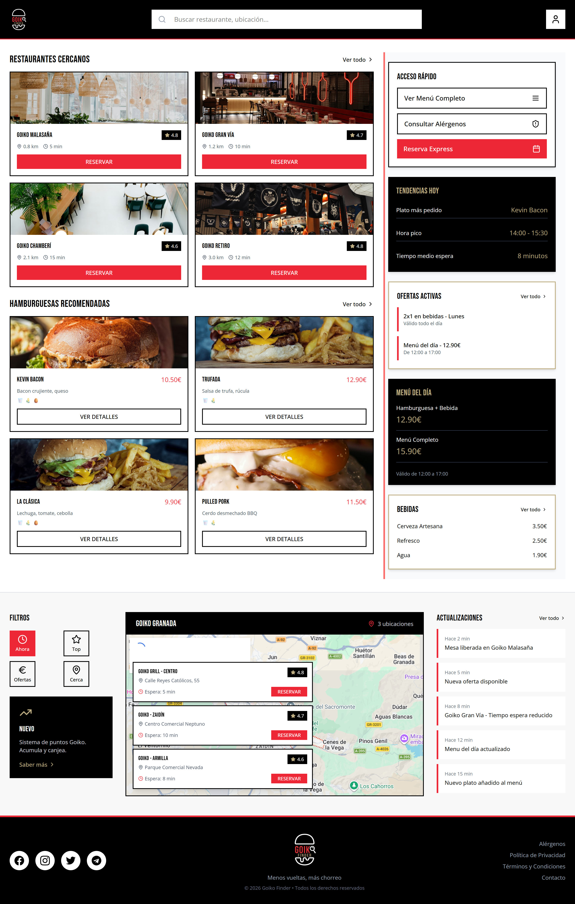

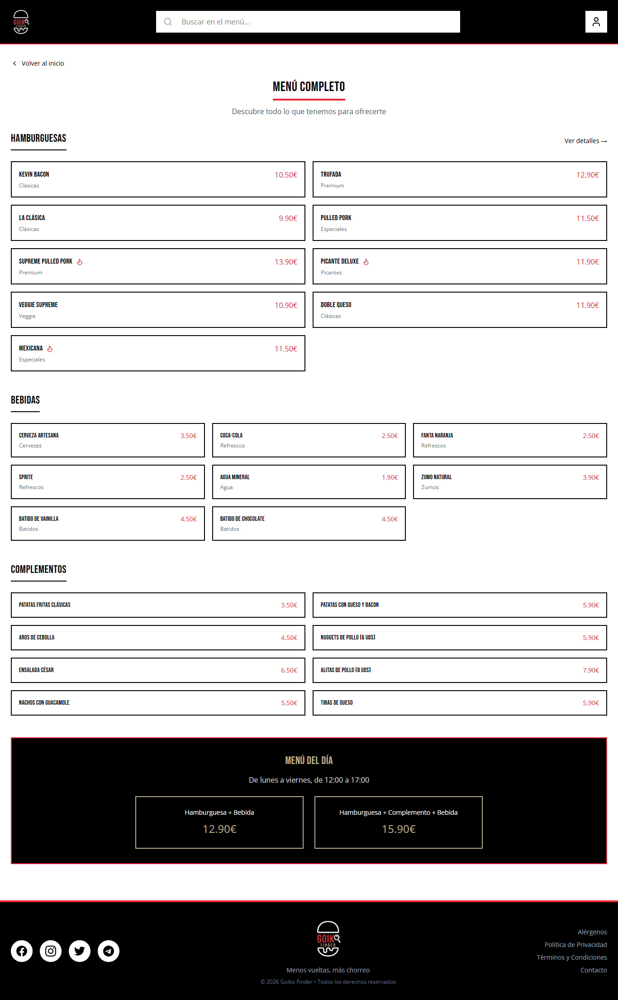


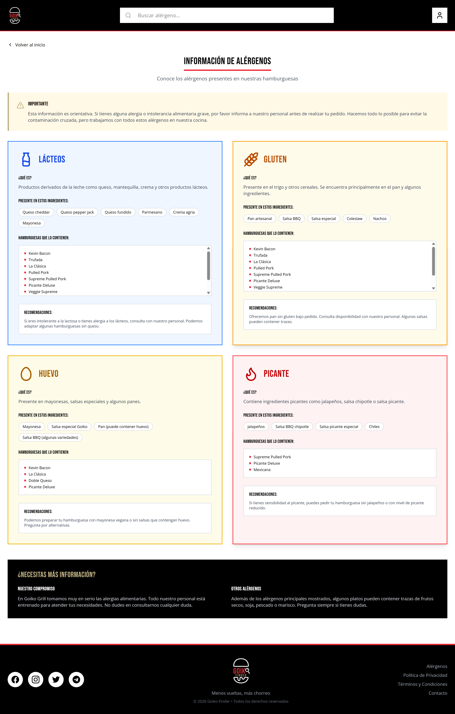

Como se ha realizado el despliegue, puede acceder a la pagina en el siguiente enlace:
[Prototipo final de Goiko ](https://visor-fabric-08824324.figma.site)

## Conclusiones finales & Valoración de las prácticas

> > > Opinión FINAL del proceso de desarrollo de diseño siguiendo metodología UX y valoración (positiva /negativa) de los resultados obtenidos. ¿Qué se puede mejorar? Recuerda que este tipo de texto se debe eliminar del template que se os proporciona
